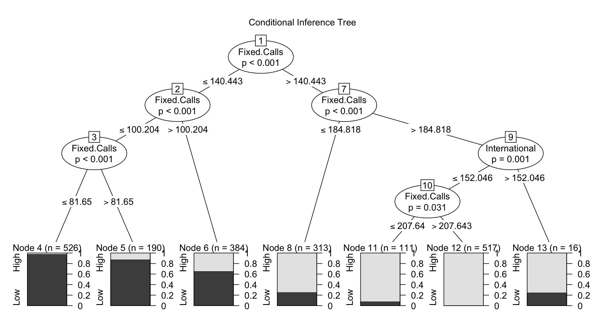
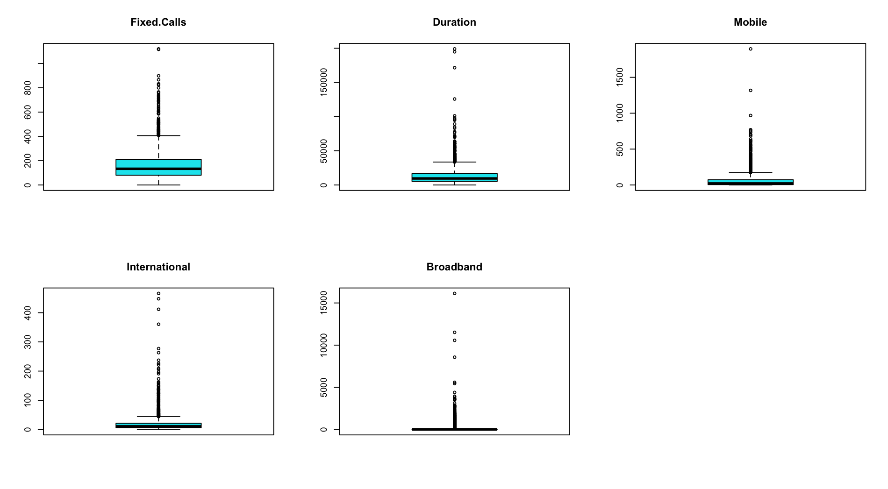
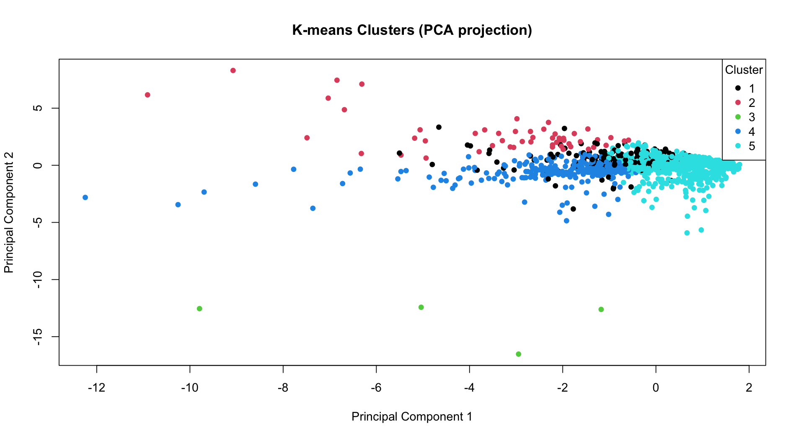

# Customer Usage Segmentation & Data Mining

## 📊 Project Overview

This project analyzes customer telephone usage patterns using R and a combination of statistical and data mining techniques. The analysis examines customer behavior across fixed calls, call duration, mobile usage, international usage, and broadband activity to identify patterns, unusual observations, and meaningful customer segments.

The project applies descriptive statistics, classification models, outlier detection, K-means clustering, and Principal Component Analysis (PCA). Together, these methods provide multiple perspectives on customer usage behavior and demonstrate how R can be used throughout the analytical process, from data exploration and preprocessing to modeling, visualization, and customer segmentation.

## 🎯 Project Objective

The objective of this project was to analyze customer telephone usage data and identify meaningful patterns in customer behavior. The analysis focused on several questions:

- How do customer usage variables relate to one another?
- Can customers be classified based on their call duration?
- Are there unusual or extreme usage patterns within the dataset?
- Can customers be grouped into distinct segments based on similar usage behaviors?
- How can dimensionality reduction help visualize differences among the identified customer segments?

## 📁 Dataset & Variables

The dataset used for this project was provided as part of the course materials and contains 2,057 customer telephone usage records. Each record includes a customer ID and five variables representing different types of telephone and service usage.

| Variable | Description |
|---|---|
| `ID` | Unique identifier for each customer record |
| `Fixed Calls` | Customer fixed-line call usage |
| `Duration` | Customer call duration |
| `Mobile` | Customer mobile usage |
| `International` | Customer international usage |
| `Broadband` | Customer broadband usage |

The five usage variables were analyzed to explore relationships among customer behaviors, identify unusual observations, develop classification models, and group customers with similar usage patterns.

For the classification portion of the analysis, `Duration` was transformed into a categorical **High/Low** variable using the median call duration as the dividing point. This allowed classification models to examine which customer usage characteristics were associated with higher or lower call duration.

> **Data Source:** The dataset was provided as part of the course materials. Because the original external source and redistribution permissions could not be verified, the raw dataset is not included in this public repository.

## 🔎 Analytical Approach

The analysis followed a multi-step data mining process to examine customer usage patterns from several perspectives.

### 1. Descriptive Analysis
Descriptive statistics were calculated for the five customer usage variables, including the mean, median, standard deviation, minimum, and maximum. A correlation matrix was also used to examine relationships among the variables.

### 2. Classification
Customer call duration was categorized as **High** or **Low** based on the median duration. Two classification approaches were then used to examine which customer usage characteristics were associated with these categories:

- CART decision tree using `rpart`
- Conditional inference tree using `ctree`

### 3. Outlier Detection
Potentially unusual customer usage patterns were evaluated using two methods:

- Z-score detection using a ±3 standard deviation threshold
- Interquartile Range (IQR) detection

Boxplots were also used to visualize the distributions and potential outliers across the usage variables.

### 4. Customer Segmentation
The usage variables were standardized before applying K-means clustering so that differences in measurement scales would not disproportionately influence the results. Customers were then grouped into **five clusters** based on similarities in their usage behavior.

### 5. Principal Component Analysis
Principal Component Analysis (PCA) was applied to the standardized usage variables to reduce the five-dimensional dataset to two dimensions. The resulting principal components were used to visualize the customer segments identified through K-means clustering.

## 📈 Analysis & Results

### Classification Results

A conditional inference tree was used to examine which customer usage characteristics were associated with **High** or **Low** call duration. The model identified `Fixed Calls` as the primary variable used to separate customers across multiple levels of the tree, with `International` usage providing an additional split among customers with higher fixed-call usage.

The tree shows a clear progression in the High/Low classification as fixed-call usage increases. Customers with lower fixed-call usage were predominantly classified in one duration category, while customers with higher fixed-call usage increasingly shifted toward the other category. The statistically significant splits indicate that fixed-call usage was strongly associated with the call-duration classification in this dataset.



*Conditional inference tree showing statistically significant splits used to classify customers by High or Low call duration.*

### Outlier Analysis

Customer usage patterns were evaluated for potential outliers using both **Z-score** and **Interquartile Range (IQR)** methods. Using multiple approaches provided different ways to identify observations that differed substantially from typical customer behavior.

Boxplots were also created for each of the five usage variables. The visualizations show numerous observations beyond the upper whiskers, particularly for `Duration`, `Mobile`, `International`, and `Broadband`. These results indicate that the dataset contains customers with substantially higher usage levels than the majority of customers.



*Boxplots of the five customer usage variables highlighting the presence and distribution of potential outliers.*

### Customer Segmentation & PCA

K-means clustering was used to group customers with similar usage behaviors across the five variables. Before clustering, the variables were standardized to prevent differences in measurement scale from disproportionately influencing the distance calculations. The analysis grouped the customer records into **five clusters**.

Because the clustering analysis used five dimensions, Principal Component Analysis (PCA) was applied to create a two-dimensional representation of the results. The PCA projection provides a visual way to examine how customers within the five clusters relate to one another based on their combined usage patterns.

The visualization shows a dense concentration of customers near the center of the projection, with overlap among several clusters. It also identifies customers and portions of clusters that extend farther from the central group, demonstrating greater differences in their overall usage patterns. Rather than indicating five completely separate customer groups, the projection shows both similarities and differences among the segments identified through K-means clustering.



*K-means customer segments visualized in two dimensions using Principal Component Analysis.*

## 🛠️ Tools & Technologies

| Tool / Technology | Use in Project |
|---|---|
| **R / RStudio** | Data preparation, statistical analysis, modeling, visualization, and output generation |
| `tidyverse` | Data manipulation and preparation |
| `rpart` & `rpart.plot` | CART decision tree modeling and visualization |
| `party` | Conditional inference tree classification |
| **K-means Clustering** | Customer segmentation based on similar usage patterns |
| **Principal Component Analysis (PCA)** | Dimensionality reduction and visualization of customer segments |
| **Z-score & IQR Methods** | Identification of potential outliers in customer usage data |

## 📂 Repository Structure

```text
customer-usage-segmentation/
│
├── README.md
│
├── code/
│   └── customer_usage_segmentation_script.R
│
├── images/
│   ├── conditional_inference_tree.png
│   ├── customer_usage_boxplots.png
│   └── kmeans_pca_clusters.png
│
└── results/
    ├── phone_results_all.txt
    ├── phone_cluster_1.txt
    ├── phone_cluster_2.txt
    ├── phone_cluster_3.txt
    ├── phone_cluster_4.txt
    └── phone_cluster_5.txt

The `code` folder contains the complete R analysis script, while `images` contains the primary visualizations used to communicate the analytical results.
The `results` folder contains the complete analysis output along with separate files for each of the five customer segments.

> **Note:** The original dataset is not included because it was provided as part of the course materials and its original source and redistribution permissions could not be independently verified.
